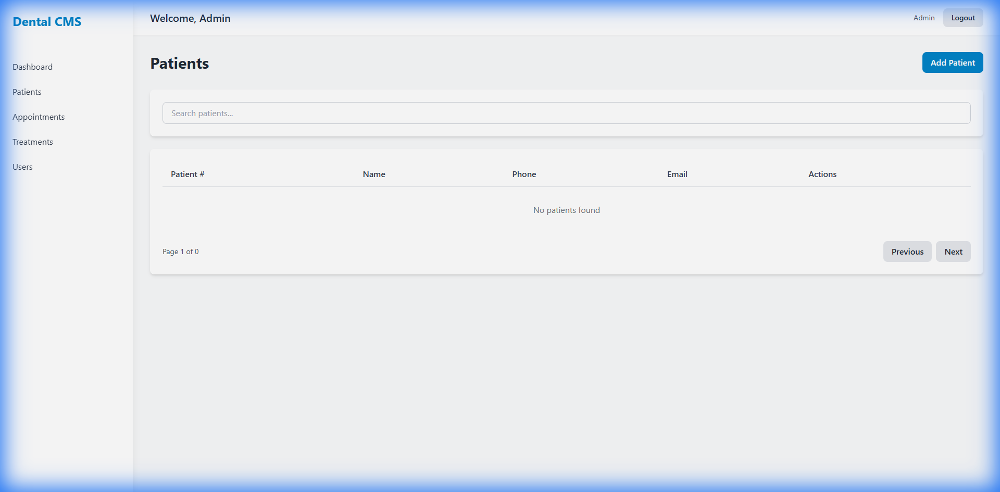
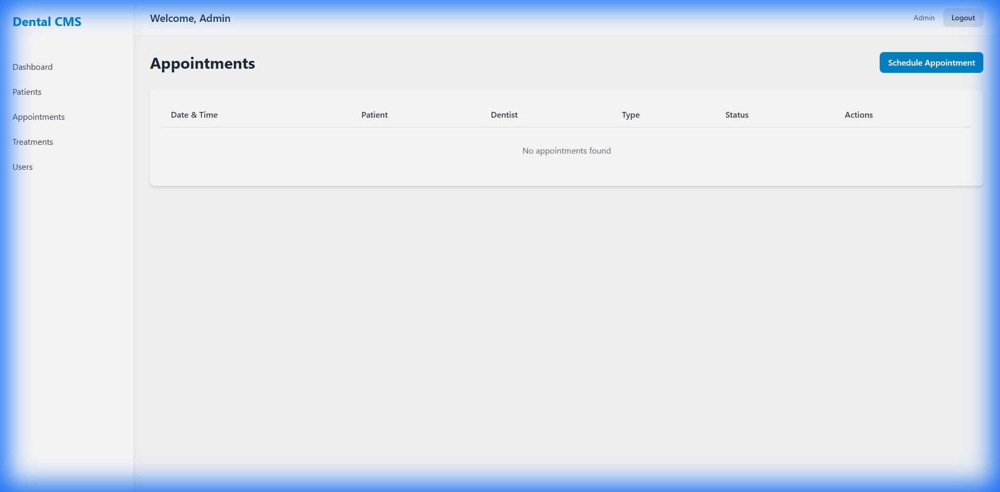
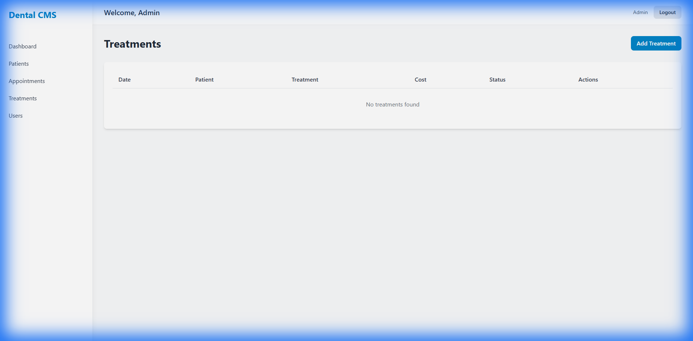
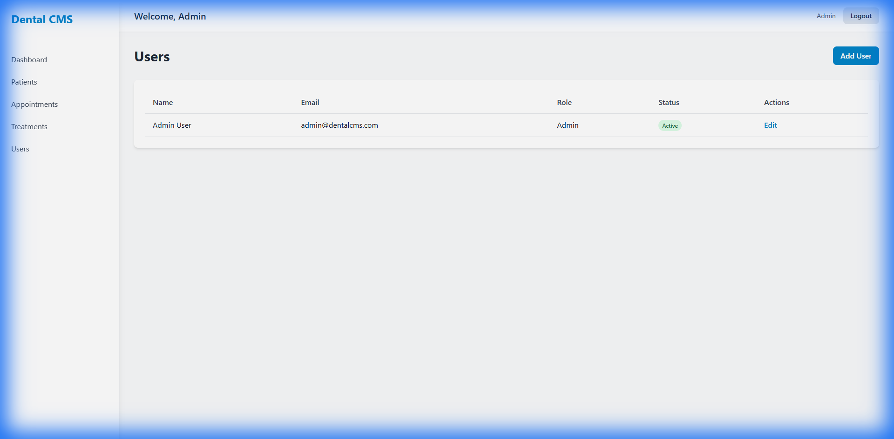

# 🦷 Dental Customer Management System (CMS)


A comprehensive full-stack application for managing dental practice operations, including patient records, appointments, treatments, and user management.

## 🚀 Easy Start

### Windows One-Click Launcher
1. Double-click `start.bat`
2. Wait for setup to finish and the app to start
3. Open `http://localhost:3000`

### Docker (All-in-One)
1. Install Docker Desktop
2. Run:
```bash
docker-compose up --build
```
3. Open `http://localhost:3000`

## ✨ Features

- **🦷 Interactive SVG Dental Chart**: Advanced modular "Teeth Template" for tracking procedures per individual tooth (Quadrants 1-4, Positions 1-8).
- **📝 Clinical History**: Detailed procedure logging with notes, dentist attribution, and local timestamping.
- **👥 Patient Management**: Complete patient records with medical history, allergies, and contact information.
- **📅 Appointment Scheduling**: Manage appointments with different types (checkup, cleaning, treatment, etc.).
- **👤 Staff Management**: Rebranded user management with role-based access control (Admin, Dentist, Assistant, Receptionist).
- **📉 Dashboard**: Overview of daily appointments, patient statistics, and pending treatments.
- **🔐 Authentication**: Secure JWT-based authentication system.
- **📱 PWA Support**: Install the application as a standalone desktop or mobile app.
- **✨ UX Optimizations**: Standardized date formatting (MM/DD/YYYY) and streamlined custom country selection.

## 📸 Screenshots

| Dashboard | Patients |
| :---: | :---: |
|  |  |

| Appointments | Treatments |
| :---: | :---: |
|  |  |

| Users |
| :---: |
|  |

## 🛠️ Tech Stack

### Backend
- **Node.js** with **Express.js**
- **TypeScript** for type safety
- **MongoDB** with **Mongoose** ODM
- **JWT** for authentication
- **Express Validator** for input validation

### Frontend
- **React** with **TypeScript**
- **Vite** for fast development and building
- **React Router** for navigation
- **React Query** for data fetching
- **Zustand** for state management
- **Tailwind CSS** for styling
- **Axios** for API requests

## 📋 Prerequisites

Before you begin, ensure you have the following installed:

- **Node.js** (v18 or higher) - [Download here](https://nodejs.org/)
- **MongoDB** (v6 or higher) - [Download here](https://www.mongodb.com/try/download/community) or use [MongoDB Atlas](https://www.mongodb.com/cloud/atlas) (cloud)
- **npm** (comes with Node.js) or **yarn**

### Quick Check

Verify your installations:

```bash
node --version    # Should be v18 or higher
npm --version     # Should be 8.x or higher
mongod --version  # Should be v6 or higher (if installed locally)
```

## 📱 Desktop Installation (PWA)

This system is built as a **Progressive Web App (PWA)**, meaning you can install it as a native desktop application:

1.  Open the application in **Chrome** or **Microsoft Edge**.
2.  Look for the **"Install" icon** (screen with a plus sign) in the right side of the address bar.
3.  Click **"Install"**.
4.  The application will now appear on your desktop and taskbar, opening in its own clean window without browser tabs.

## 🚀 Quick Start Guide

### Step 1: Clone the Repository

```bash
git clone <repository-url>
cd dental-cms
```

### Step 2: Install All Dependencies

**Option A: One Command (Recommended)**
```bash
npm run install:all
```

This will automatically install dependencies for both the backend and frontend.

**Option B: Manual Installation**
```bash
# Install backend dependencies
npm install

# Install frontend dependencies
cd client
npm install
cd ..
```

### Step 3: Set Up Environment Variables

Create a `.env` file in the root directory:

**Windows:**
```bash
copy .env.example .env
```

**Mac/Linux:**
```bash
cp .env.example .env
```

Or create it manually with the following content:

```env
PORT=5000
NODE_ENV=development
MONGODB_URI=mongodb://localhost:27017/dental-cms
JWT_SECRET=your-super-secret-jwt-key-change-this-in-production
JWT_EXPIRE=7d
CORS_ORIGIN=http://localhost:3000
```

> ⚠️ **Important**: Change `JWT_SECRET` to a strong, random string in production!

### Step 4: Start MongoDB

**If using local MongoDB:**
- **Windows**: MongoDB should start automatically as a service. If not, start it manually.
- **Mac/Linux**: Run `mongod` in a terminal

**If using MongoDB Atlas (Cloud):**
- Update `MONGODB_URI` in your `.env` file with your Atlas connection string
- No local installation needed!

### Step 5: Create Admin User

Create the initial admin user:

```bash
npm run create:admin
```

This will create an admin user with:
- **Email**: `admin@dentalcms.com`
- **Password**: `admin123`

> ⚠️ **Security Note**: Change this password immediately after first login!

### Step 6: Start the Application

Start both the backend and frontend servers:

```bash
npm run dev
```

This will start:
- **Backend server** on `http://localhost:5000`
- **Frontend server** on `http://localhost:3000`

### Step 7: Access the Application

Open your browser and navigate to:

```
http://localhost:3000
```

Login with the admin credentials:
- **Email**: `admin@dentalcms.com`
- **Password**: `admin123`

## 📝 Complete Setup Script

For a complete automated setup (installs dependencies + creates admin user):

```bash
npm run setup
```

Then just start MongoDB and run `npm run dev`!

## 🎯 Running the Application

### Development Mode

**Start both servers:**
```bash
npm run dev
```

**Start servers separately:**

Backend only:
```bash
npm run dev:server
```

Frontend only:
```bash
npm run dev:client
```

### Production Mode

1. Build the application:
```bash
npm run build
```

2. Start the production server:
```bash
npm start
```

## 📁 Project Structure

```
dental-cms/
├── src/
│   └── server/              # Backend code
│       ├── config/          # Configuration files
│       ├── controllers/     # Route controllers
│       ├── middleware/      # Custom middleware
│       ├── models/          # Mongoose models
│       ├── routes/          # API routes
│       ├── scripts/         # Utility scripts (admin creation)
│       └── utils/           # Utility functions
├── client/                  # Frontend code
│   ├── src/
│   │   ├── components/      # Shared React components
│   │   ├── features/        # Modular features (e.g., dental-chart)
│   │   ├── pages/           # Page components
│   │   ├── store/           # Zustand stores
│   │   └── utils/           # Utility functions
│   └── public/              # Static assets
├── .env                     # Environment variables (create this)
└── package.json             # Root package.json
```

## 🔑 Default Login Credentials

After running `npm run create:admin`, you can login with:

- **Email**: `admin@dentalcms.com`
- **Password**: `admin123`

> ⚠️ **Important**: Change this password immediately after first login!

## 📚 Available Scripts

| Command | Description |
|---------|-------------|
| `npm run install:all` | Install all dependencies (backend + frontend) |
| `npm run setup` | Complete setup (install + create admin user) |
| `npm run create:admin` | Create initial admin user |
| `npm run dev` | Start both servers in development mode |
| `npm run dev:server` | Start backend server only |
| `npm run dev:client` | Start frontend server only |
| `npm run build` | Build for production |
| `npm start` | Start production server |
| `npm run lint` | Run ESLint |

## 🔌 API Endpoints

### Authentication
- `POST /api/auth/register` - Register a new user (Admin only)
- `POST /api/auth/login` - Login user
- `GET /api/auth/me` - Get current user

### Patients
- `GET /api/patients` - Get all patients
- `GET /api/patients/:id` - Get patient by ID
- `POST /api/patients` - Create new patient
- `PUT /api/patients/:id` - Update patient
- `DELETE /api/patients/:id` - Deactivate patient

### Appointments
- `GET /api/appointments` - Get all appointments
- `GET /api/appointments/:id` - Get appointment by ID
- `POST /api/appointments` - Create new appointment
- `PUT /api/appointments/:id` - Update appointment
- `DELETE /api/appointments/:id` - Delete appointment

### Treatments
- `GET /api/treatments` - Get all treatments
- `GET /api/treatments/:id` - Get treatment by ID
- `POST /api/treatments` - Create new treatment
- `PUT /api/treatments/:id` - Update treatment
- `DELETE /api/treatments/:id` - Delete treatment

### Users
- `GET /api/users` - Get all users (Admin only)
- `GET /api/users/:id` - Get user by ID (Admin only)
- `PUT /api/users/:id` - Update user (Admin only)
- `DELETE /api/users/:id` - Deactivate user (Admin only)

## 👥 User Roles

- **Admin**: Full access to all features including user management
- **Dentist**: Access to patients, appointments, and treatments
- **Assistant**: Access to patients, appointments, and treatments
- **Receptionist**: Access to patients and appointments

## 🗄️ Database Schema

The application uses MongoDB with the following main collections:

- **Users**: Staff members with authentication and role information
- **Patients**: Patient records with personal, medical, and insurance information
- **Appointments**: Scheduled appointments with status tracking
- **Treatments**: Treatment records with procedure details and billing

## 🐛 Troubleshooting

### MongoDB Connection Issues

**Problem**: "MongoDB connection error"

**Solutions**:
- Ensure MongoDB is running: `mongod` or check Windows Services
- Verify `MONGODB_URI` in `.env` file is correct
- For MongoDB Atlas, check your connection string and IP whitelist

### Port Already in Use

**Problem**: "Port 5000 or 3000 already in use"

**Solutions**:
- Change `PORT` in `.env` file (for backend)
- Kill the process using the port:
  - Windows: `netstat -ano | findstr :5000` then `taskkill /PID <pid> /F`
  - Mac/Linux: `lsof -ti:5000 | xargs kill`

### Dependencies Installation Issues

**Problem**: npm install fails

**Solutions**:
- Clear npm cache: `npm cache clean --force`
- Delete `node_modules` and `package-lock.json`, then run `npm install` again
- Ensure Node.js version is 18 or higher

### Admin User Already Exists

**Problem**: "Admin user already exists" when running `create:admin`

**Solution**: This is normal if you've already created the admin user. You can either:
- Use the existing credentials
- Delete the user from MongoDB and run the script again
- Create a new user through the UI (Admin → Users → Add User)

## 🔒 Security

- Passwords are hashed using bcrypt
- JWT tokens for authentication
- Input validation using express-validator
- Role-based access control
- CORS configuration

## 🧪 Development

### Code Style

The project uses ESLint for code linting:

```bash
npm run lint
```

### TypeScript

Both backend and frontend use TypeScript. Type checking is performed during build.

## 📦 Production Deployment

1. Set `NODE_ENV=production` in your `.env` file
2. Update `JWT_SECRET` to a strong, random string
3. Update `MONGODB_URI` to your production database
4. Update `CORS_ORIGIN` to your production frontend URL
5. Build the application: `npm run build`
6. Start the server: `npm start`

## 🤝 Contributing

1. Create a feature branch
2. Make your changes
3. Test thoroughly
4. Submit a pull request

## 📄 License

MIT

## 💬 Support

For issues and questions, please open an issue on the repository.

---

**Made with ❤️ for dental practices**
