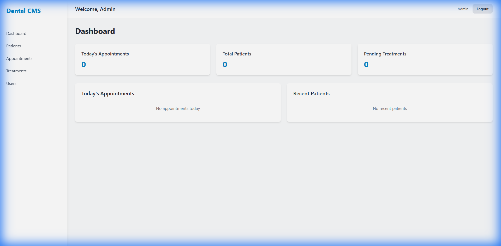

# Dental CMS



Dental CMS is a full-stack system for managing patient records, appointments, treatments, and staff access in a dental practice. It includes an interactive dental chart, scheduling, billing status tracking, and exports for reporting.

## For Users

### Log In
- Open the web app provided by your clinic (e.g., `https://your-clinic-url`).
- Enter your staff email and password.
- If you’re a first-time admin, see “Getting Started (Admin)” below.

### Core Workflows
- **Patients**: Create and manage patient profiles, contact details, and history.
- **Appointments**: Schedule, edit, and track appointment status.
- **Treatments**: Record procedures, costs, payments, and outcomes.
- **Calendar**: Visual view of upcoming appointments.
- **Users (Admin only)**: Add and manage staff access and roles.
- **Reports**: Export lists to CSV/JSON and print summaries.

### Roles & Access

| Role | Patients | Appointments | Treatments | Users | Reports |
|------|----------|--------------|------------|-------|---------|
| Admin | Full | Full | Full | Full | Full |
| Dentist | Full | Full | Full | No | No |
| Assistant | Full | Full | Full | No | No |
| Receptionist | Full | Full | No | No | No |

## Getting Started (Admin)

1. Log in with the admin credentials supplied by your IT team.
2. Go to **Users** and add staff members.
3. Ask each staff member to change their password after first login.

If you need to generate a default admin locally, see “Setup for IT”.

## Reports & Exports

- **List pages** (Patients, Appointments, Treatments, Users) support sorting and search.
- **Export** data to CSV or JSON from the Admin Reports tool.

## Troubleshooting

- **Can’t log in**: Confirm your email/password with an admin.
- **Missing data**: Check filters, date ranges, and search fields.
- **Access denied**: Your role may not allow that action. Ask an admin to review access.

## Setup for IT (Optional)

### Prerequisites
- Node.js v18+
- MongoDB v6+ (local or Atlas)
- Docker Desktop (optional)

### Environment
Create a `.env` file at the repo root:

```env
PORT=5000
NODE_ENV=development
MONGODB_URI=mongodb://localhost:27017/dental-cms
JWT_SECRET=change-this-in-production
JWT_EXPIRE=7d
CORS_ORIGIN=http://localhost:3000
```

### Run Locally
```bash
npm run install:all
npm run create:admin
npm run dev
```

- Backend: `http://localhost:5000`
- Frontend: `http://localhost:3000`

Default admin (local):
- Email: `admin@dentalcms.com`
- Password: `admin123`

### Docker
```bash
docker-compose up --build
```

## Tech Stack

- **Backend**: Node.js, Express, TypeScript, MongoDB (Mongoose)
- **Frontend**: React, TypeScript, Vite, Tailwind CSS

## Support

Contact your clinic’s IT administrator for assistance.
